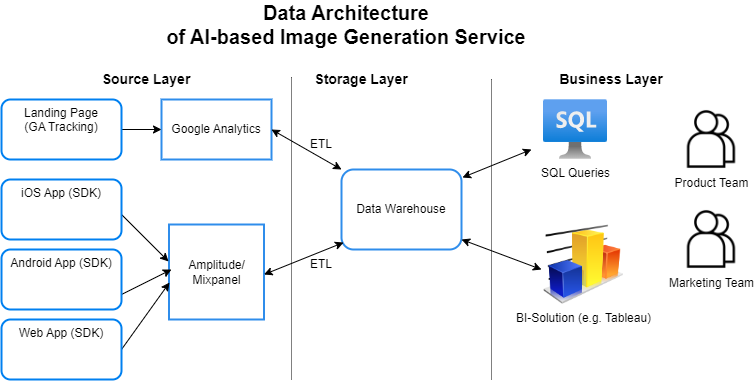

# Module 1 - Homework

## 1. Analytic solution architecture

Our first task in this module was to draw the top-level architecture of the analytic solution using draw.io or similar tools.

Architecture should have three layers:

- Source Layer - data source layer
- Storage Layer - data storage layer
- Business Layer - layer for access to data of business users

As a possible example, I chose an AI-based image generation service (a mobile and web service) developed by a startup team.
 
Below is my solution:

## 2. Сreating the dashbord in Excel

Then we had to create the dashboard in Excel from the [Superstore.xls](sources/Sample%20-%20Superstore.xls) file using Lookup, pivot tables and other functions of Excel.

Superstore is a mock dataset. It provides detailed sales information for a company that sells to different types of customers in the USA. The dataset contains information for 4 years (from 2016 to 2019).

Here is my dashbord:

